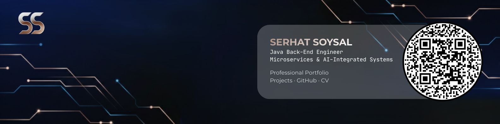

  

# Hi, I'm Serhat 👋

I am a **Software Engineer** dedicated to engineering high-performance distributed systems and orchestrating enterprise-level AI ecosystems. My expertise lies in building resilient, mission-critical architectures that harmonize complex business logic with cutting-edge technological scalability.

### 🏗️ Architectural Vision & Strategy
* **System Resilience & Stability:** Implementing advanced patterns like **Bulkheads**, **Circuit Breakers**, and **SAGA** for distributed transactions to ensure high availability in high-traffic environments.
* **Modern Design Philosophies:** Deep focus on **Domain-Driven Design (DDD)**, **Hexagonal (Ports & Adapters) Architecture**, and **CQRS** to minimize technical debt and maximize maintainability.
* **Event-Driven Intelligence:** Architecting reactive, non-blocking infrastructures powered by **Apache Kafka** and **RabbitMQ** for real-time data orchestration.
* **Cloud-Native & Serverless:** Optimizing infrastructure costs and performance using **AWS Lambda (FaaS)**, Containerization (**K8s/Docker**), and Infrastructure as Code (**Terraform**).

### 🤖 Generative AI & Multimodal Engineering
* **AI Orchestration:** Designing production-ready pipelines for **Multimodal AI** (Vision + Voice + LLM) to create intuitive human-machine interfaces.
* **RAG & Agentic Systems:** Implementing **Retrieval-Augmented Generation (RAG)** frameworks and autonomous AI agents with sophisticated tool-calling capabilities.
* **Scalable AI Infrastructure:** Transitioning high-impact AI prototypes into secure, monitorable, and scalable cloud-native microservices.

### 🧠 Core Expertise Summary
* 🚀 **Enterprise Mastery:** Proven track record in optimizing mission-critical backend systems at global industry leaders.
* ⚙️ **Technical Stack Leadership:** Deep specialization in the **Java/Spring Ecosystem** and **Python** for advanced AI/ML implementations.
* 🎓 **Systems Engineering:** MIS background with a strategic focus on automation, architectural efficiency, and data-driven decision-making.

### 💻 Advanced Tech Stack & Ecosystem
| Layer | Technologies & Frameworks |
| :--- | :--- |
| **Architectural Patterns** | DDD, CQRS, Event-Driven (EDA), Hexagonal, FaaS, SAGA, Microservices, Onion Architecture |
| **Backend & Core** | Java (8/11/17/21), Spring Boot 3.x, Spring Cloud, Hibernate, FastAPI, Python, Scala |
| **GenAI & LLM Stack** | OpenAI API, LangChain, RAG, Vector Databases (Pinecone/Milvus), TTS, Computer Vision |
| **Cloud & DevOps** | AWS (Lambda, EC2, S3, RDS, SNS/SQS), Kubernetes (K8s), Docker, Terraform, Helm, CI/CD |
| **Data & Persistence** | PostgreSQL, MySQL, MongoDB, Redis (Cache & Pub/Sub), DynamoDB, Elasticsearch |
| **Messaging & Streaming** | Apache Kafka, RabbitMQ, ActiveMQ, Amazon EventBridge |
| **Security & Identity** | OAuth2, OpenID Connect, JWT, Spring Security, AWS IAM, HashiCorp Vault |
| **Observability & QA** | Prometheus, Grafana, ELK Stack, SonarQube, JUnit 5, Mockito, Testcontainers, BDD |

---

### 📊 Professional Tech Stack & Mastery

<table width="100%">
  <tr>
    <td align="center" width="20%"></td>
    <td align="center" width="20%"></td>
    <td align="center" width="20%"></td>
    <td align="center" width="20%"></td>
    <td align="center" width="20%"></td>
  </tr>
  <tr>
    <td align="center" width="20%"></td>
    <td align="center" width="20%"></td>
    <td align="center" width="20%"></td>
    <td align="center" width="20%"></td>
    <td align="center" width="20%"></td>
  </tr>
  <tr>
    <td align="center" width="20%"></td>
    <td align="center" width="20%"></td>
    <td align="center" width="20%"></td>
    <td align="center" width="20%"></td>
    <td align="center" width="20%"></td>
  </tr>
  <tr>
    <td align="center" colspan="5">
      
      
      
      
      
      
      
      
    </td>
  </tr>
</table>

---

### 📫 Reach me at:
📧 **Email:** [serhatsoysalx@gmail.com](mailto:serhatsoysalx@gmail.com)  
🔗 **LinkedIn:** [soysalserhat](https://www.linkedin.com/in/soysalserhat)  
🌐 **Portfolio:** [serhatsoysal.com](https://https://serhatsoysal.com/)  
📍 **Location:** Dubai, UAE
